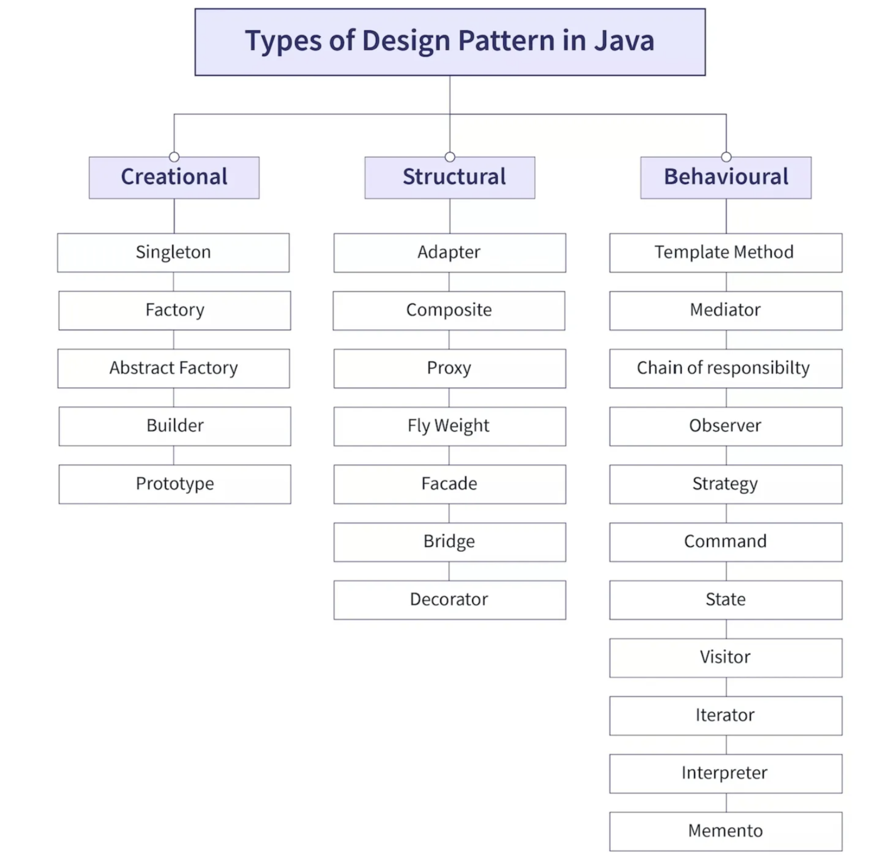
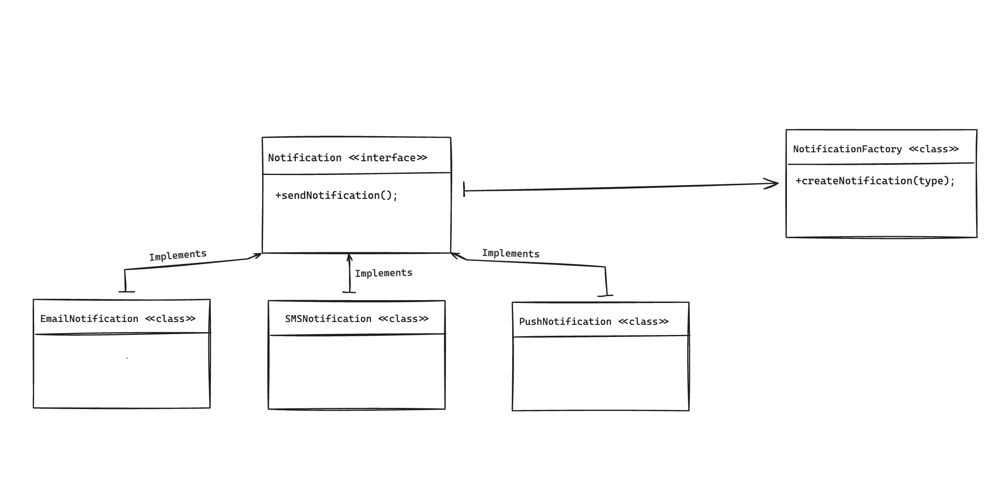
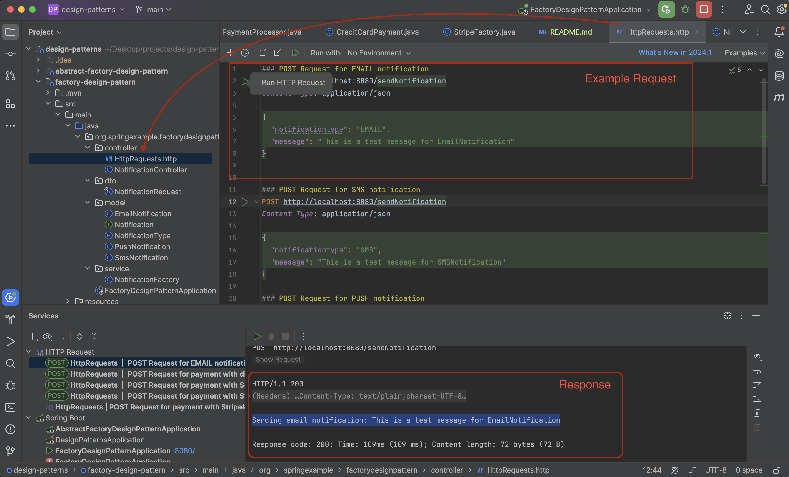
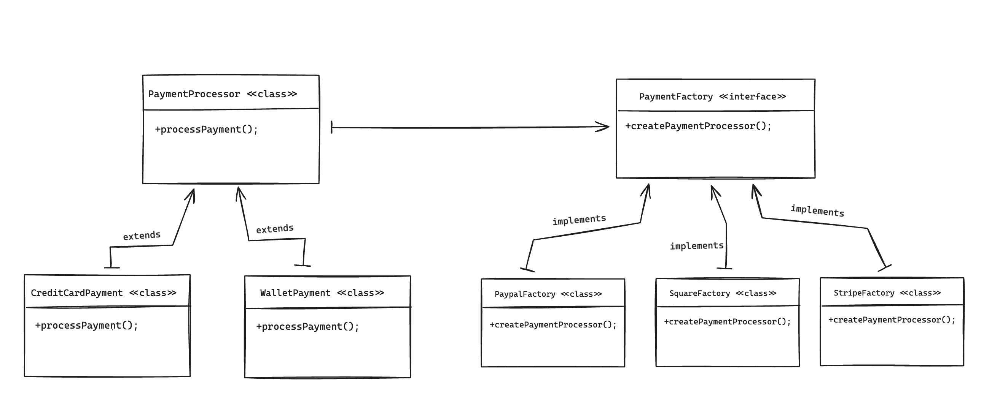
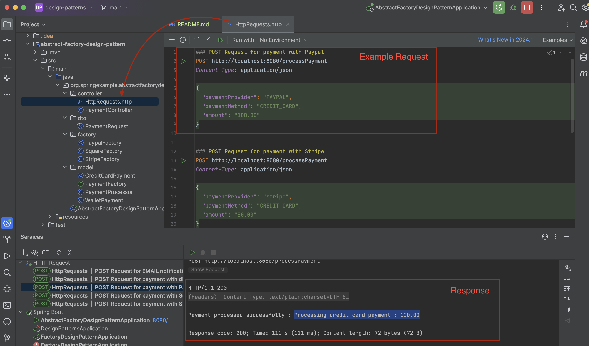

# Design Patterns Project

Design patterns represent the best practices used by experienced object-oriented software developers. Design patterns are solutions to general problems that software developers faced during software development. These solutions were obtained by trial and error by numerous software developers over quite a substantial period of time. The examples provided are aimed to illustrate their usage, advantages, and implementation in real-world scenarios.

## What Are Design Patterns?

Design patterns are typical solutions to common problems in software design. They are like blueprints that can be customized to solve a particular design problem in your code. Design patterns are divided into three main categories:
1. **Creational Patterns**: These patterns provide various object creation mechanisms, which increase flexibility and reuse of existing code.
2. **Structural Patterns**: These patterns explain how to assemble objects and classes into larger structures while keeping these structures flexible and efficient.
3. **Behavioral Patterns**: These patterns are concerned with algorithms and the assignment of responsibilities between objects.

## Why do we need Design Patterns?

- **Reusable Solutions**: Provide a proven solution to common problems.
- **Readability and Maintenance**: Improve the readability and maintenance of the code.
- **Development Efficiency**: Enhance development speed and efficiency by providing standard approaches to common problems.
- **Best Practices**: Encourage best practices and provide a shared vocabulary for developers.
- **Open-Closed Principle**: There are some princiles called SOLID. Open-Closed says that **open for extension but closed for modification.** For example if you want to add new type for payment mode or notification type, You have to change all java code from where used in code. But if you use design pattern, You can add new type easily.

## Factory Design Pattern

### Overview

The Factory Design Pattern is a creational design pattern that provides an interface for creating objects in a superclass, but allows subclasses to alter the type of objects that will be created. It helps in creating objects without having to specify the exact class of the object that will be created.

### Why Use Factory Design Pattern?

- To centralize the object creation process.
- To improve code readability and maintainability.
- To manage and control the lifecycle of objects.
- To implement decoupling in code where the code that uses the objects doesn't need to know about the specifics of their creation.

### Notification Example

In this module, we demonstrate the Factory Design Pattern using a notification system that can send different types of notifications such as Email, SMS, and Push Notifications.

#### Implementation

#### Example Requests

#### Advantages
- Centralizes object creation logic.
- Enhances code maintainability and readability.
- Makes the system more flexible and extensible.

## Abstract Factory Design Pattern

### Overview

The Abstract Factory Design Pattern is a creational design pattern that provides an interface for creating families of related or dependent objects without specifying their concrete classes. This pattern is useful when you need to create various kinds of related objects, but you want to ensure that the objects are created in a consistent manner.

### Why Use Abstract Factory Design Pattern?

- To ensure that a family of related objects are used together.
- To isolate the code that needs to create and manipulate a set of related objects.
- To provide a way to encapsulate a group of individual factories.

### Payment Processor Example

In this project, we demonstrate the Abstract Factory Design Pattern using a payment processing system that supports multiple payment providers such as PayPal, Stripe, and Square, and different payment methods such as Credit Card and Wallet.

#### Implementation

#### Example Requests

#### Advantages
- Provides a way to encapsulate a group of individual factories.
- Ensures consistency among related objects.
- Enhances flexibility and scalability.

